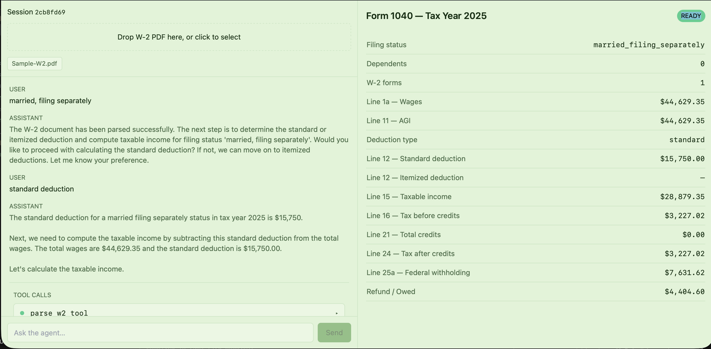
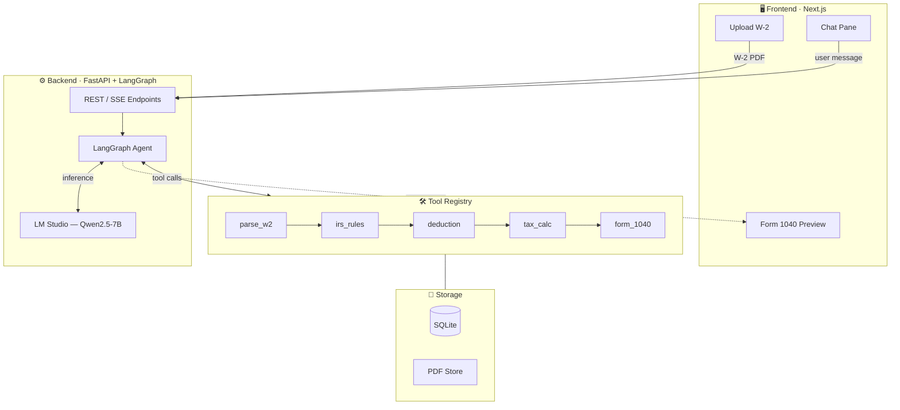
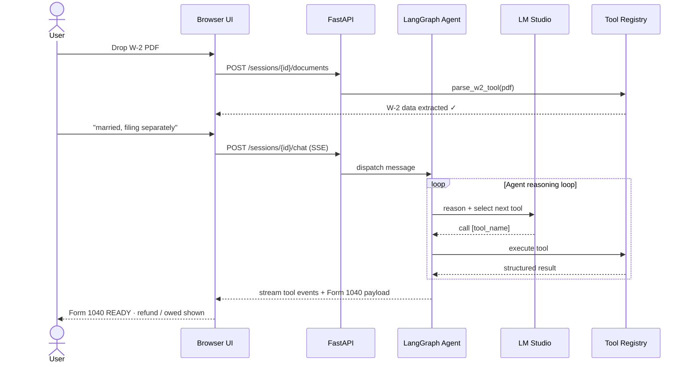

# Tax Filing Assistant



A local-first tax filing assistant for 2025 returns.

This app uses a local LM Studio instance with Qwen-style models and a tool-driven backend to parse W-2s, apply IRS rules, compute deductions, and render a Form 1040 preview.

---

## 🚀 What this does

- Parses uploaded W-2 PDFs with a local ingest pipeline
- Extracts wages, withholding, and form fields
- Looks up IRS rules from local JSON rule tables
- Computes standard/itemized deduction and federal tax owed
- Builds a draft Form 1040 preview in the browser
- Runs entirely locally with LM Studio + Qwen/GLM model

---

## 🎯 Why it matters

This project demonstrates a self-hosted tax assistant that does not rely on external LLM APIs. Everything happens locally:

- FastAPI backend
- Next.js frontend
- SQLite persistence
- LM Studio + Qwen model serving
- Local OCR and PDF parsing

---

## ✨ Highlights

- Built as a tool-calling agent using LangGraph
- Local rule source for IRS thresholds and standard deductions
- Automatic W-2 ingestion + computation pipeline
- Full Form 1040 preview with deduction and return state
- Designed for rapid testing, demos, and product launches

---

## 🧠 Backend architecture

The backend is the core of the product. It exposes:

- `POST /sessions` → create a session
- `POST /sessions/{id}/documents` → upload a W-2 PDF
- `GET /sessions/{id}/return` → fetch the current draft return
- `POST /sessions/{id}/chat` → stream agent conversation and tool events

The agent pipeline is implemented in:

- `backend/app/agent/graph.py`
- `backend/app/agent/nodes.py`
- `backend/app/agent/checkpointer.py`

The tool registry and pure calculation engine live in:

- `backend/app/tools/registry.py`
- `backend/app/tools/calculations.py`
- `backend/app/tools/w2.py`
- `backend/app/tools/forms.py`
- `backend/app/tools/rules.py`

Rule data and tax brackets are stored locally in:

- `backend/app/data/brackets_2025.json`
- `backend/app/data/irs_rules_2025.json`

---

## 📦 Local stack

- **Backend**: FastAPI + LangGraph agent orchestration
- **Frontend**: Next.js App Router UI
- **LLM runtime**: Local LM Studio (`http://localhost:1234/v1`)
- **Model**: Qwen family (Qwen2.5-7B-Instruct / Qwen7B)
- **Storage**: SQLite + local filesystem PDF storage
- **OCR**: Tesseract local installation

---

## 🧩 System design



---

## 👤 User story



---

## 🛠️ Tool flow

The backend uses tool calling for deterministic work:

1. **parse_w2_tool** — converts uploaded PDF into structured W-2 JSON
2. **lookup_irs_rule_tool** — loads local IRS rules by topic
3. **compute_std_deduction_tool** — returns the correct standard deduction
4. **compute_itemized_deduction_tool** — totals Schedule A itemized entries
5. **compute_tax_owed_tool** — applies tax brackets to taxable income
6. **generate_form_1040_tool** — builds the final Form 1040 payload

Each tool runs locally and updates the `return_draft` state in the agent.

---

## 🧠 Why local LM Studio

This product is built to demonstrate an end-to-end local LLM experience.

- Local inference via LM Studio
- No OpenAI / Azure / remote LLM calls
- Works with Qwen2.5-7B-Instruct or Qwen7B locally
- Easy to demo locally with a privacy-first architecture

---

## 🎬 Media

### Demo recording

[](https://youtu.be/KKgYsWP2RBA)

*Full demo: upload W-2 → agent runs tools → Form 1040 preview rendered locally*

---

## 📁 Project layout

```text
backend/   FastAPI + LangGraph agent + tool registry + ingestion
frontend/  Next.js App Router UI + preview components
storage/   local SQLite dbs + uploaded PDFs
tests/     pytest suites for parser, calc, and rules
```

---

## ⚡ Run locally

```bash
cd backend
python -m venv ../.venv
source ../.venv/bin/activate
pip install -e ".[dev]"
```

Install OCR engine:

```bash
brew install tesseract     # macOS
# apt-get install tesseract-ocr   # Linux
```

Start LM Studio and load Qwen model:

1. Open LM Studio locally
2. Load **Qwen2.5-7B-Instruct** or **Qwen7B**
3. Confirm service runs at `http://localhost:1234/v1`

Create `.env` with:

```env
LM_STUDIO_BASE_URL=http://localhost:1234/v1
LM_STUDIO_API_KEY=lm-studio
MODEL_NAME=qwen2.5-7b-instruct
```

Run backend and frontend:

```bash
# backend
uvicorn backend.app.main:app --reload --host 127.0.0.1 --port 8000

# frontend
cd frontend && npm install && npm run dev
```

Or use the helper script:

```bash
./run-dev.sh
```

---

## ✅ Highlights

- Local-first, no cloud LLM calls
- Built for real tax workflow validation
- Includes rule-driven tax bracket and deduction logic
- Great for developers who want a local agent + backend toolchain

---

## 🧪 Testing

```bash
cd backend
pytest
```

---

## 📌 Backstory

This project is designed as a privacy-preserving tax assistant prototype. It proves that you can wire a local LLM into reliable business logic and maintain the structure of a real tax return without exposing sensitive data to third parties.
